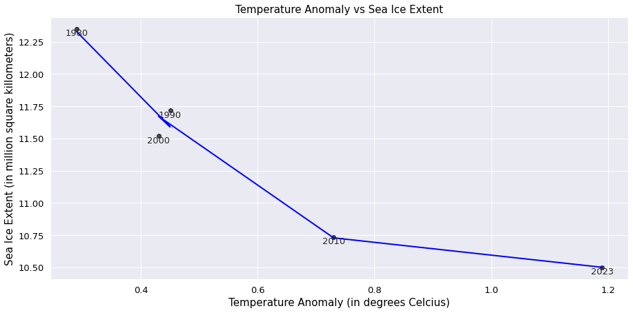
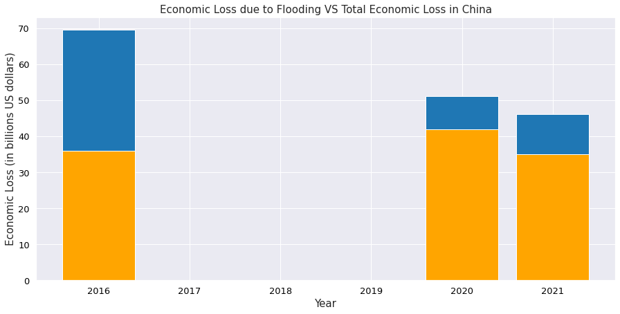
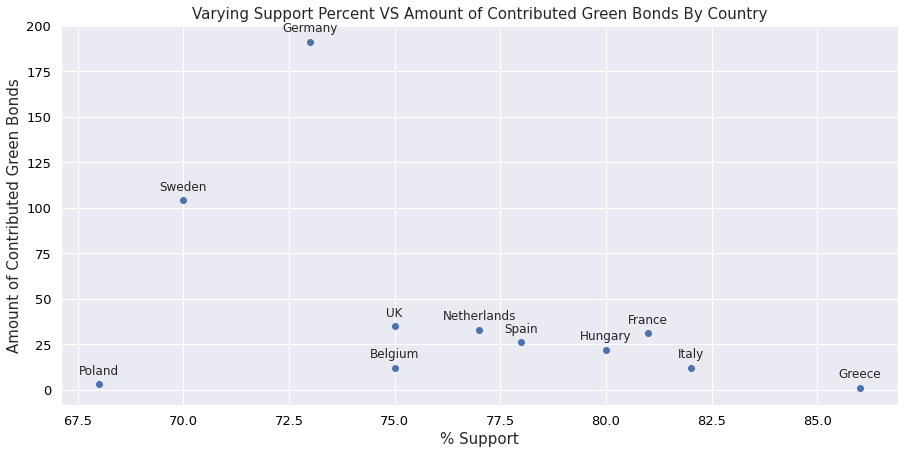
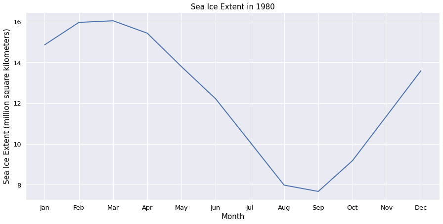
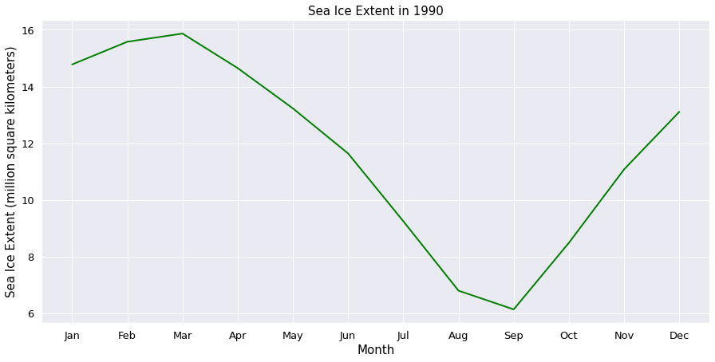
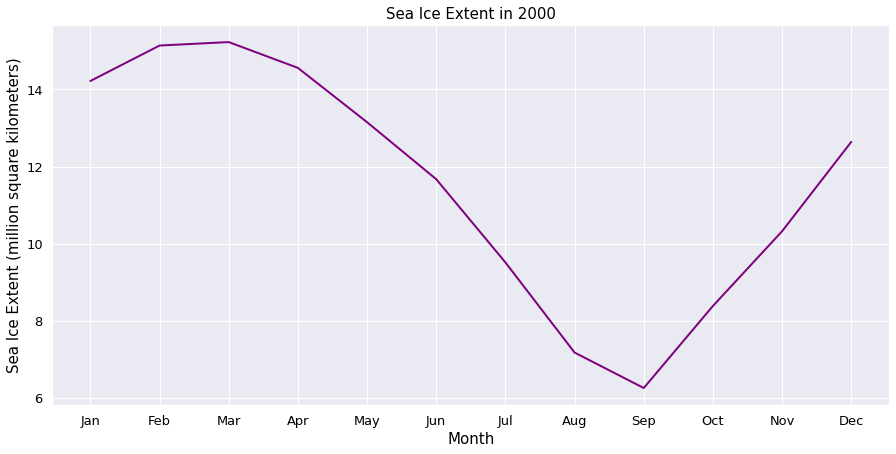
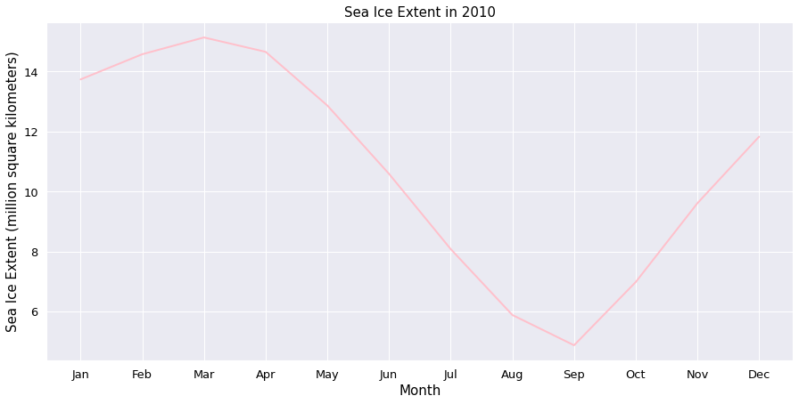
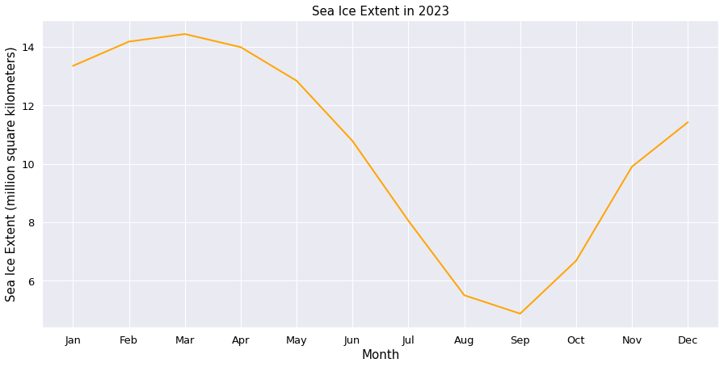

# Global Climate Change
#### 3125 Individual Project
Sofia Toropova
toropovas@wit.edu


## Introduction

The project was undertaken to analyze the impacts of temperatures rising on the sea ice extent levels. Also, it was interesting to see how the public support of climate change actions impact the contributions of each country to environmental initiatives. 

The objecticve of the project is to examine the impact of global temperature change on various aspects of natural life. For example, the melting down of sea ice. However, other impact include the change in economics and social influence. 

Three questions were taken into consideration and answered to further the objective analysis of the global climate change:

1. How have the anomalies in temperature impacted the sea ice extent? What is the predicted sea ice extent in 2030?
2. What effect has flooding have on the economy in China? And how drastic was that effect?
3. What countries have showcased over 70% of support for climate emergency action? And did that support result in action? 

## Selection of Data

Most data comes from Statista datasets from the following sources:
-  [Sea Ice Extent](https://www.statista.com/statistics/1299082/northern-hemisphere-sea-ice-extent/)
-  [Temperature Anomalies](https://www.statista.com/statistics/224893/land-and-ocean-temperature-anomalies-based-on-temperature-departure/)
- [Economic Loss from Natural Disasters in China 2022](https://www.statista.com/statistics/1118042/china-economic-loss-from-natural-disasters/)
- [Economic Losses due to Flooding](https://www.statista.com/statistics/1413779/largest-floods-economic-damage-worldwide/)
-  [Public Support](https://www.statista.com/statistics/1201071/climate-emergency-public-support-globally-by-country/)
- [Green Bonds](https://www.statista.com/statistics/1090928/green-bonds-issuance-volume-europe/#statisticContainer)

The data includes the calculated statistics from 1900s to 2023. 

Before utilizing the data, the excel files were modified for ease of use in the analysis. For example, overview pages were eliminated and some columns were shifted to provide a more comprehensive view of the data. Some features for the unnecessery years were modified to fit requirements of the analysis.

For the dataset [Economic Losses due to Flooding](https://www.statista.com/statistics/1413779/largest-floods-economic-damage-worldwide/), the yuan data was converted to usd, so that the losses could be used in camparison with other datasets that are in usd. Used conversion rates as of April 1, 2023.

#### Data access preview

Data excel files are loaded to the Jupyter system, located in the same folder as the notebook, so that Panda's function read_excel() could be used to read in the files.

`sea_ice_extent_data = pd.read_excel("northern-hemisphere-sea-ice-extent-per-month-1980-2023.xlsx")`

The code snippet above demonstrates a way how the data files were accessed within the Jupyter Notebook.

`data_1980 = sea_ice_extent_data.loc[year]` 

The example above is the way to access data by year. By running the following snippet, we can see the month and the corresponding value of sea ice extent in million square kilometers.

To answer some questions, it is required to combine the data from [Sea Ice Extent](https://www.statista.com/statistics/1299082/northern-hemisphere-sea-ice-extent/) and [Temperature Anomalies](https://www.statista.com/statistics/224893/land-and-ocean-temperature-anomalies-based-on-temperature-departure/), therefore, we create lists to store the necessary information, and then parse the data into a Pandas DataFrame:

```
model_year.append(year)
model_temp_anomaly.append(temp_anom_2023)
model_average_sea_extent.append(average_sea_ice_extent_2023)
data = pd.DataFrame({'Year': model_year, 'Temperature Anomaly': model_temp_anomaly, 'Sea Ice Extent': model_average_sea_extent})
```

Other ways used to combine the datasets:

```
merged_df = pd.merge(green_bonds_data, public_support_data, on='Country', how='inner')
```
This way the two datasets are merged into one dataframe, and therefore, it makes it easier to visualize the data with plots.

## Methods
#### Tools:
- NumPy, Pandas for data analysis and inference
- Seaborn and Matplotlib.pyplot for data visualization
- GitHub for version control
- VS Code as IDE

#### Inference methods with Scikit:
Scikit was needed to answer the first questions of the research: 1. How have the anomalies in temperature impacted the sea ice extent? What is the predicted sea ice extent in 2030?

To fit the data most closely, the linear regression feature space had to be increased to second degree, and therefore, Polynomical Features were used:

```
from sklearn.preprocessing import PolynomialFeatures

poly = PolynomialFeatures(degree=2)
x_poly = poly.fit_transform(x)

model = LinearRegression()
model.fit(x_poly, y)

plt.plot(x, model.predict(x_poly), color='blue', linewidth=2)
```

This way the line of best fit resembelled a curve-like shape, therefore, being close to the data points.

Linear regression is a statistical method used to model the relationship between the dependent and independent variables. In this case, the dependent variable was the sea ice extent, while the independent variable is the temperature anomaly. Linear regression model in higher feature space means that more flexibility was added, so that the model regresents a closer fit to the data. The purpose of multiple linear regression is to estimate the coefficient and create the equation that would be used to predict the dependent variable as accurate as possible.

Linear regression was chosen for this question because the question asks to predict the sea ice extent in 2030. Therefore, the equation generated by linear regression can be used for such prediction.

#### Other methods:
- Merging of datasets to generate a dataframe of all necessary data
- Filtering data to have only values above a specific values
- Finding average of values
- Finding total values of data columns
- Visualizing data with line, scatter, and bar plots
- Annotation graphs for clarity

## Results

### 1. How have the anomalies in temperature impacted the sea ice extent? What is the predicted sea ice extent in 2030?
The temperature anomalies have drastically impacted the sea ice extent. As temperature anomalies increase and shift farther away from the accepted average, the amount of sea ice extent decreases, which means more of the sea ice is melting, disrupting the appropriate water circulation. The predicted value of sea ice extent in 2030 is 10.76



### 2. What effect has flooding have on the economy in China? And how drastic was that effect?
On average, in 2022, flooding has contributed to about 69.85% of economic loss in China. 



The chosen years are 2016, 2020, and 2021 because these years were present in both datasets, [Economic Loss from Floods in China 2022](https://www.statista.com/statistics/1118042/china-economic-loss-from-natural-disasters/) and [Economic Losses due to Flooding](https://www.statista.com/statistics/1413779/largest-floods-economic-damage-worldwide/). The blue color represents the total economic loss in China for the given year, while the orange color is the economic loss due to floods.


### 3. What countries have showcased over 70% of support for climate emergency action? And did that support result in action? 
There are 11 countries from the [Public Support](https://www.statista.com/statistics/1201071/climate-emergency-public-support-globally-by-country/) dataset that have showcased over 70% support for climate emergency action. These countries are:
1. Germany
2. Sweden
3. UK
4. Netherlands
5. France
6. Spain
7. Hungary
8. Belgium
9. Italy
10. Poland
11. Greece

To showcase whether the support of those countries has resulted into action, we can view the plot below:



Thye scatter plot represents the data of percentage support vs the amount of green bonds contributed by each country.

## Discussion

### 1. How have the anomalies in temperature impacted the sea ice extent? What is the predicted sea ice extent in 2030?

Sea ice helps regulate exchanges of heat, moisture, and salinity in the polar oceans. However, as temperatures rise, ice begins to melt, which means that with progressive melting and deviations from normal could disrupt the water balance and circulation. 

To predict the sea ice extent in 2030, five data points were chosen, specifically, the years: 1980, 1990, 2000, 2010, and 2023. The graphs below show the result for each of the years.

#### 1980


#### 1990


#### 2000


#### 2010


#### 2023


These data points were then used to make the resulting graph below.


This graph shows the line of best fit, created by linear regression. Linear regression was in feature space two because curve-like shape fit the data more closely. The equation of the line is $y = 3.48x^2 - 7.18x + 14.12$, where x is the temperature anomaly. 

Then using linear regression again to determine the realtionship between the years and the temperature anomalies, meaning how much has temperature changed over the 10 years. To do so:

```
years = np.array(list(temp_anomalies_data['Temperature'].keys())).reshape(-1, 1)

temps = np.array(list(temp_anomalies_data['Temperature'].values)).reshape(-1, 1)

model = LinearRegression()
model.fit(years, temps)

next_year = np.array([[2030]])
predicted_temp = model.predict(next_year)
temp_anom_2030 = predicted_temp[0][0]
```

With this code, temp_anom_2030 = 0.7159 is the predicted value for temperature anomaly in 2030, and therefore, it is the value to be used in the equation, $y = 3.48x^2 - 7.18x + 14.12$. As a result, when x is 0.7159, y, or the sea ice extent in 2030, is 10.76.

### 2. What effect has flooding have on the economy in China? And how drastic was that effect?
To answer this question [Economic Loss from Natural Disasters in China 2022](https://www.statista.com/statistics/1118042/china-economic-loss-from-natural-disasters/) dataset was modified to add a new column, an equivalence of US dollars to yuan currency in the data. This was accomplished due to the fact that multiple datasets had to be used to answer the question and they all were in US dollars, so therefore, to make accurate comparisons, the currency had to be the same. 

Then from [Economic Losses due to Flooding](https://www.statista.com/statistics/1413779/largest-floods-economic-damage-worldwide/) dataset, only values that represented floods in China were chosen, so that the proportions of economic losses were accurate, relating to the same country. The data points were extracted as such:

```
# available flood data in China between 2013 to 2021
# 2016
flood_2016 = flood_data['Economic Loss'][8]
total_2016 = economic_loss_data['Economic Loss (billion US dollars)'][2016]

# 2020
flood_2020 = flood_data['Economic Loss'][5]
total_2020 =economic_loss_data['Economic Loss (billion US dollars)'][2020]

# 2021
flood_2021 = flood_data['Economic Loss'][9]
total_2021 = economic_loss_data['Economic Loss (billion US dollars)'][2021]
```

Then the results were used to calculate the average between 2016, 2020, and 2021 to understand the total economiv loss due to flooding.

```
percent_2016 = round(data_2016[0]/data_2016[1]*100, 2)
percent_2020 = round(data_2020[0]/data_2020[1]*100, 2)
percent_2021 = round(data_2021[0]/data_2021[1]*100,2)

percent_arr = [percent_2016, percent_2020, percent_2021]

sum_per = 0
for percent in percent_arr:
    sum_per += percent
average_percent = round(sum_per / len(percent_arr), 2)
```

As a result, the calculations revealed that on average between the three years about 69.85% of economic loss was due to flooding.

### 3. What countries have showcased over 70% of support for climate emergency action? And did that support result in action? 


We can see that Greece, which has over 80% public support, has contributed onle one green bond. However, we should also take other factors, like population, into the account. Nonetheless, the scatter plot illustrates that not every country that has the public support has actually developed a system of financial funding for green bonds.

Green bonds are funds issued to support environmental projects. Therefore, the graph illustrates how much countries with over 70% climate action support have contributed to projects that promote environmental awareness and/or positively impact the environment. 

## Future Work
There are more questions that could be answered with these datasets, and therefore, the research can be expanded. Also, the linear regression models and further examination of current relationship between sea ice extent and temperature anomalies can be used to create new graphs with presumed results for the future, predicting the variables for the future years.

## References
- [Sea Ice Climate](https://oceanservice.noaa.gov/facts/sea-ice-climate.html#:~:text=Changes%20in%20the%20amount%20of,to%20climate%20change%20on%20Earth)
- [Sea Ice Matters](https://nsidc.org/learn/parts-cryosphere/sea-ice/why-sea-ice-matters#:~:text=Sea%20ice%20helps%20regulate%20exchanges,ocean%20to%20atmosphere%20in%20winter)
-  [Sea Ice Extent](https://www.statista.com/statistics/1299082/northern-hemisphere-sea-ice-extent/)
-  [Temperature Anomalies](https://www.statista.com/statistics/224893/land-and-ocean-temperature-anomalies-based-on-temperature-departure/)
- [Economic Loss from Natural Disasters in China 2022](https://www.statista.com/statistics/1118042/china-economic-loss-from-natural-disasters/)
- [Economic Losses due to Flooding](https://www.statista.com/statistics/1413779/largest-floods-economic-damage-worldwide/)
-  [Public Support](https://www.statista.com/statistics/1201071/climate-emergency-public-support-globally-by-country/)
- [Green Bonds](https://www.statista.com/statistics/1090928/green-bonds-issuance-volume-europe/#statisticContainer)